# 🌱 Farmia Arcade

<p align="center">
  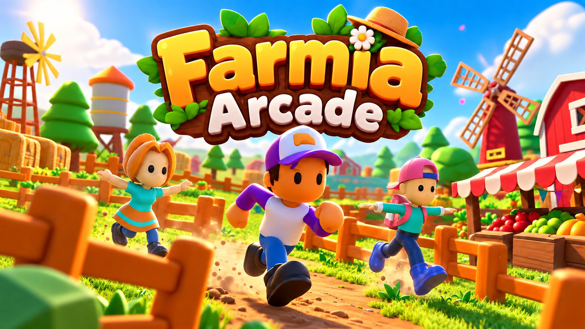
</p>

[](https://unity.com/)
[](https://play.unity.com)
[](LICENSE)

A 3D arcade farming game built with **Unity 6**. Buy seeds, plant them, harvest the vegetables, stock your market shelves and collect the money when customers pay at the register. The game has no end, so keep growing your farm!

🎮 **[Play the Game in Your Browser (Unity Play)](https://play.unity.com/en/games/481a99a2-f681-4b24-8632-e5343ca8ec9d/farmia-arcade)**

---

## 📸 Screenshots

*In-game screenshots:*

<p align="center">
  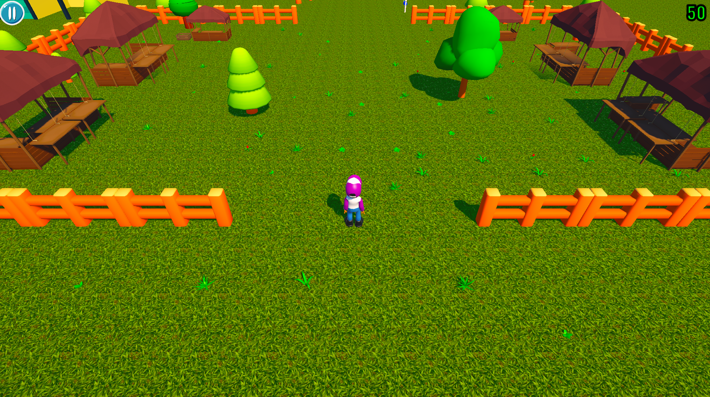
</p>

### Gameplay Loop

| 1. Collect Seeds | 2. Plant | 3. Grown Vegetables | 4. Carry |
| :---: | :---: | :---: | :---: |
| 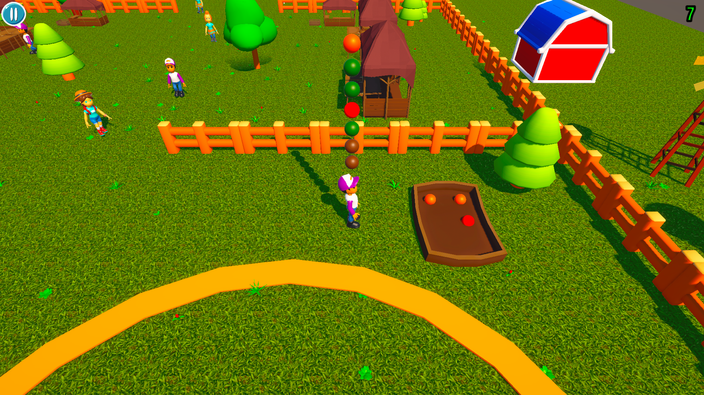 | 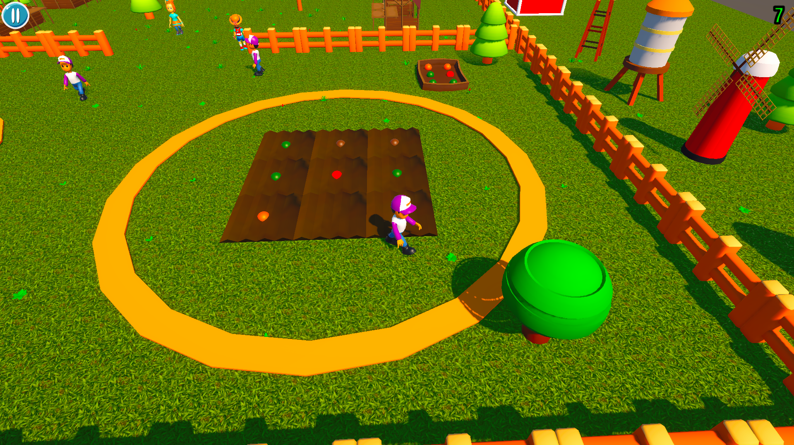 | 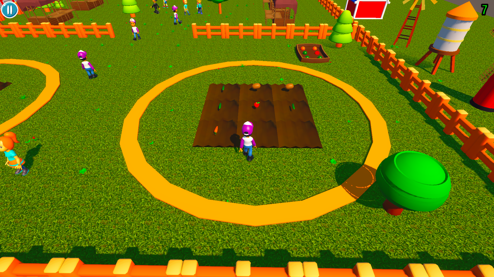 | 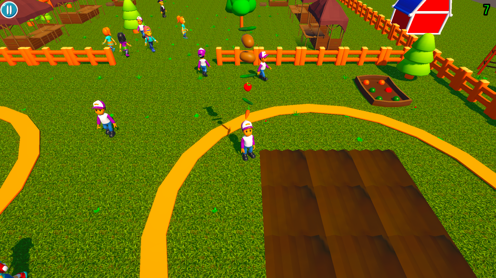 |

| 5. Stock the Shelf | 6. Customers Pay | 7. Collect Money |
| :---: | :---: | :---: |
| 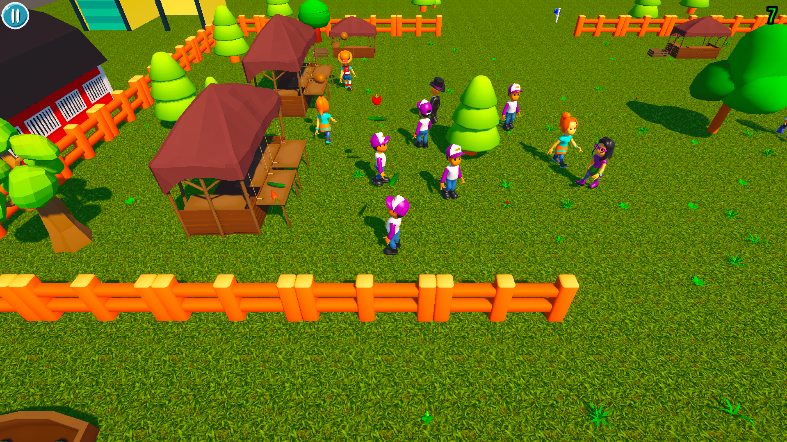 | 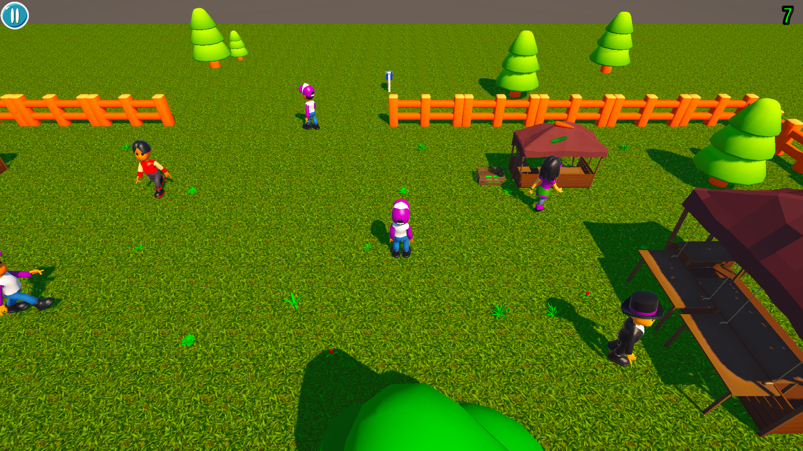 | 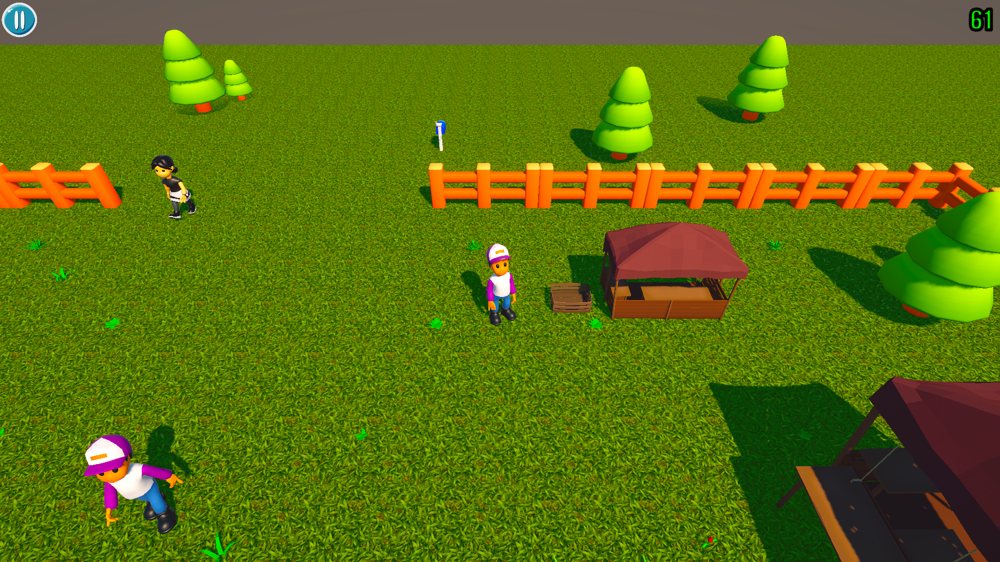 |

### Menus

| Main Menu | Settings | Pause | Pause Settings |
| :---: | :---: | :---: | :---: |
| 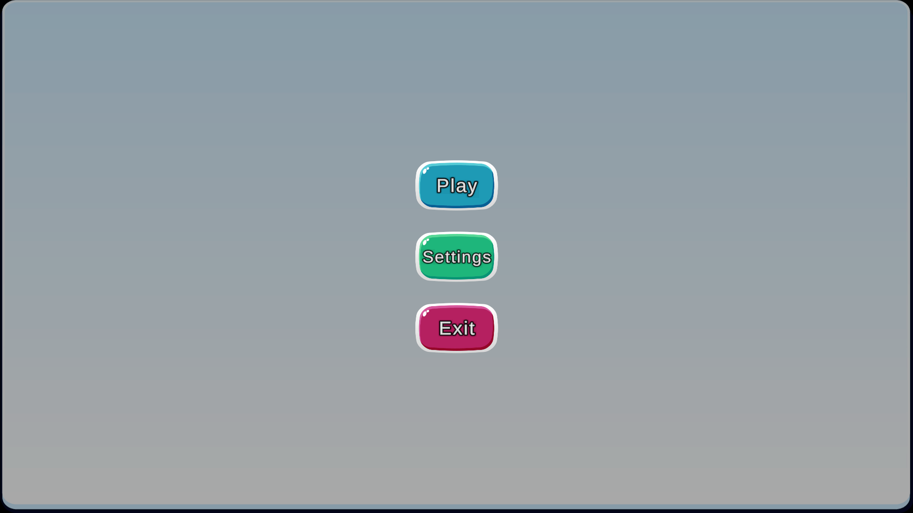 | 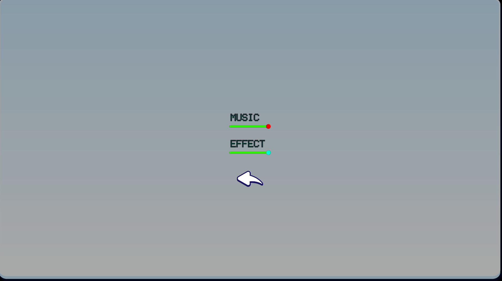 | 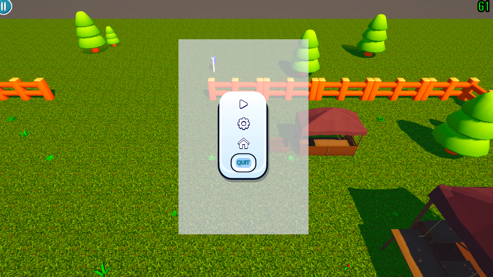 | 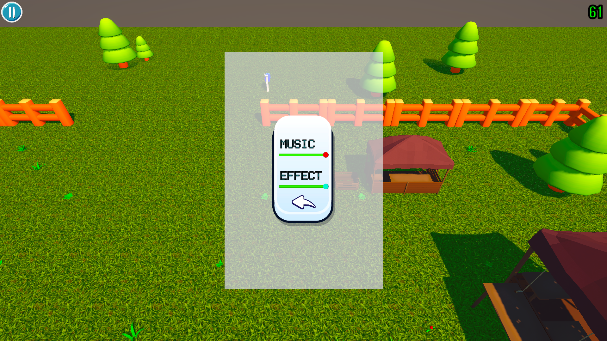 |

---

## ✨ Features

- **Farming Loop:** Pick up seeds, plant them on farm plots, wait for them to grow and harvest the vegetables.
- **Shop System:** Place harvested vegetables on shelves. Customers take products and pay at the register, then you collect the money piles.
- **Customer AI:** Customers use Unity's NavMesh and a state machine (patrol, check shelf, pay, exit). They wander around the market, take 1-3 products and leave after paying.
- **Customer Spawner:** Different customer characters spawn over time up to a maximum count.
- **Coin Economy:** Seeds cost coins and sales earn coins, shown live on the HUD.
- **Random Seed Generator:** Seed generators periodically spawn random seed types into free slots.
- **Item Stacking:** Carried items stack above the character's head.
- **Touch / Mouse Controls:** A virtual-joystick style drag control designed for mobile.
- **Event-Driven Architecture:** Systems communicate through C# events managed by a central `FarmManager`.
- **Interface-Based Interaction:** Items, farm plots, shelves and money share a common `IInteraction` interface, and carryable items inherit from an abstract `BaseItem`.
- **Menus & Settings:** Main menu, pause menu and a settings panel with separate music and effect sliders (Audio Mixer, saved with PlayerPrefs).
- **Audio System:** Music and sound effects for planting, harvesting, shelves, customers, money, footsteps and UI.
- **Endless Gameplay:** There is no end condition, the goal is to keep earning coins.

---

## 🕹️ Controls

| Action | Input |
| ------ | ----- |
| **Move** | Hold the left mouse button (or touch) and drag in the direction you want to move |
| **Interact** | Automatic, walk into seeds, plants, shelves and money piles |

---

## 🧩 Scripts

| Script | Purpose |
| ------ | ------- |
| `CharacterController` | Movement, carried item stack and interaction via triggers |
| `PlayerInput` | Mouse / touch drag input |
| `FarmManager` | Central event hub and shelf / register registry |
| `GameManager` | Coin balance and coin events |
| `FarmArea` | Planting spot for seeds |
| `Seed` / `Vegetable` | Seed growth timer and harvestable product |
| `SeedGenerator` | Spawns random seeds into free slots |
| `BaseItem` / `IInteraction` | Shared base for carryable items and the interaction interface |
| `Shelf` | Display slots for vegetables |
| `BaseCustomer` | NavMesh customer state machine: patrol, check shelf, pay, exit |
| `CustomerSpawner` | Spawns customers periodically up to a limit |
| `Cash` / `Money` | Register that stacks money piles, and the collectible money |
| `UIManager` | Coin counter |
| `AudioManager` / `FootStep` | Music, sound effects and footstep events |
| `MainMenu` / `PauseMenu` / `VolumeSettings` | Menus, pause and volume sliders |

---

## 🛠️ Tech Stack & Assets

- **Engine:** Unity 6.3 LTS (6000.3.13f1)
- **Language:** C#
- **Input:** Legacy Input Manager (mouse / touch)
- **AI:** Unity NavMesh (AI Navigation)
- **Assets & Packages:**
  * Characters: [Hyper Casual Human Characters](https://assetstore.unity.com/packages/3d/characters/hyper-casual-human-characters-305473)
  * Vegetables: [Casual Vegetable Pack](https://assetstore.unity.com/packages/3d/props/food/casual-vegetable-pack-created-with-fastmesh-asset-293783)
  * Environment: [Farming GameDev Starter Kit (Free Edition)](https://assetstore.unity.com/packages/3d/environments/farming-gamedev-starter-kit-free-edition-243035), [Low Poly Farm Pack Lite](https://assetstore.unity.com/packages/3d/environments/industrial/low-poly-farm-pack-lite-188100), [Low Poly Medieval Market](https://assetstore.unity.com/packages/3d/environments/low-poly-medieval-market-262473), [Pandazole Farm Ranch Low Poly Pack](https://assetstore.unity.com/packages/3d/props/pandazole-farm-ranch-low-poly-pack-206756)
  * Ground materials: [YughuesFree Ground Materials](https://assetstore.unity.com/packages/2d/textures-materials/nature/yughues-free-ground-materials-13001)
  * UI: [371 Simple Buttons Pack](https://assetstore.unity.com/packages/2d/gui/icons/371-simple-buttons-pack-97516), [Universal Stylized UI](https://assetstore.unity.com/packages/2d/gui/universal-stylized-ui-270506)
  * Footsteps: [Footsteps Essentials](https://assetstore.unity.com/packages/audio/sound-fx/foley/footsteps-essentials-189879)
  * Other sound effects: [Pixabay](https://pixabay.com/)

---

## 📁 Project Structure

```
Assets/
└── Development/
    ├── Animation/
    ├── Material/
    ├── Model/
    ├── PhysicMaterials/
    ├── Prefab/
    ├── Scenes/      → S_MainMenu, S_GameScene
    ├── Script/
    ├── Sound/
    └── Texture/
```

---

## 🚀 Getting Started (Local Setup)

1. **Clone the repository:**
```
   git clone https://github.com/emirsumer/Farmia_Arcade.git
```
2. **Open with Unity:** Add the folder in Unity Hub and use Unity 6000.3.13f1 (or a compatible Unity 6 version).
3. **Run the Game:** Open `Assets/Development/Scenes/S_MainMenu.unity` (not the game scene directly) and press **Play**.

---

## 🙏 Credits

- The core gameplay logic was developed together with my instructor; I built the UI and added some features on top.
- 3D models, UI and footstep sounds from the Unity Asset Store; other sound effects from Pixabay.
- Cover art: AI-generated.

## 📜 License

This project is open-source and available under the MIT License.
